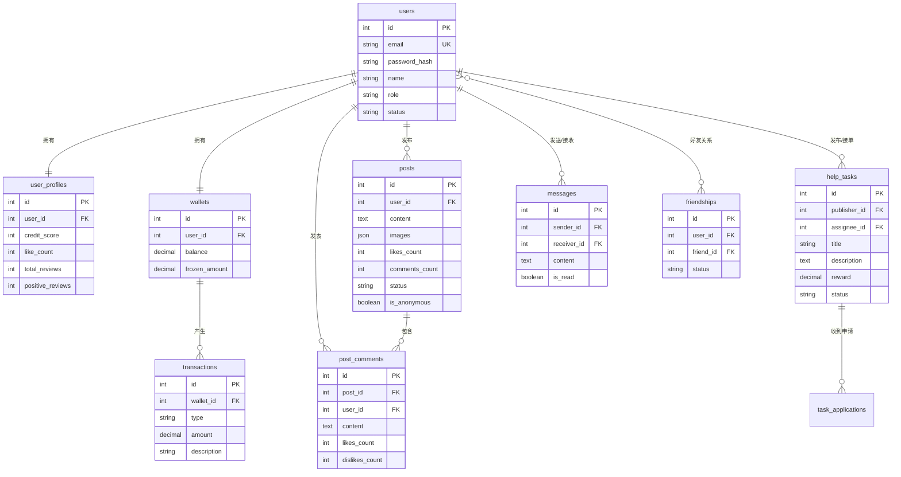

# 第三章：系统设计与技术实现

本章简要介绍平台的技术选型与架构设计，并重点讲解几个核心技术实现亮点。

## 3.1 技术栈概览

| 技术 | 用途 | 说明 |
|------|------|------|
| Next.js + React | 前端框架 | React全栈框架，支持服务端渲染，组件化开发，界面构建高效 |
| TypeScript | 类型安全 | 静态类型检查，减少运行时错误，提高代码可维护性 |
| Tailwind CSS | 样式框架 | 原子化CSS，快速构建美观的响应式界面 |
| Python FastAPI | 后端框架 | 高性能异步Web框架，自动生成API文档，类型提示友好 |
| SQLAlchemy | ORM框架 | Python最主流的ORM，支持多种数据库，模型定义清晰 |
| WebSocket | 实时通讯 | 全双工通信协议，实现即时消息推送 |
| JWT | 身份认证 | 无状态令牌认证，前后端分离架构下的标准方案 |

### 开发工具

| 工具 | 用途 |
|------|------|
| Visual Studio Code | 代码编辑器 |
| Chrome DevTools | 前端调试与性能分析 |
| Swagger UI | FastAPI自动生成的API文档，便于接口调试 |
| SQLite Browser | 开发环境数据库查看工具 |

## 3.2 系统架构设计

### 3.2.1 整体架构

本平台采用前后端分离的B/S架构，前端和后端独立运行，通过RESTful API和WebSocket进行通信。

```
用户浏览器（PC / 手机）
        │
        │  HTTP / WebSocket
        ▼
┌─────────────────────────┐
│  前端 (Next.js + React) │  端口 3000
│  · 页面路由与渲染        │
│  · UI组件与交互逻辑      │
│  · API请求封装           │
│  · WebSocket客户端       │
└───────────┬─────────────┘
            │  RESTful API / WebSocket
            ▼
┌─────────────────────────┐
│  后端 (FastAPI)         │  端口 8000
│  · API路由处理           │
│  · 业务逻辑             │
│  · 数据模型(SQLAlchemy)  │
│  · WebSocket服务端       │
│  · 定时任务(APScheduler) │
└───────────┬─────────────┘
            │  SQL
            ▼
┌─────────────────────────┐
│  数据库                  │
│  · 开发: SQLite          │
│  · 生产: MySQL/PostgreSQL│
└─────────────────────────┘
```

### 3.2.2 项目目录结构

```
SmartCampusServicePlatform/
├── app/                    # Next.js 前端页面
│   ├── page.tsx           # 首页
│   ├── login/             # 登录页
│   ├── register/          # 注册页
│   ├── posts/             # 校园墙相关页面
│   ├── tasks/             # 互助任务相关页面
│   ├── messages/          # 消息相关页面
│   └── profile/           # 个人中心相关页面
├── components/             # React可复用组件
├── lib/                    # 工具库与API服务层
├── backend/                # FastAPI后端
│   └── app/
│       ├── api/           # API路由模块
│       ├── core/          # 核心功能（安全、配置）
│       ├── models/        # 数据库模型
│       ├── schemas/       # 请求/响应数据结构定义
│       ├── websocket/     # WebSocket连接管理
│       └── tasks/         # 定时任务
├── start.sh               # 一键启动脚本
└── stop.sh                # 停止脚本
```

## 3.3 核心技术实现亮点

### 3.3.1 基于WebSocket的实时通讯

**实现思路：**

即时通讯功能选择WebSocket方案而非传统的轮询方式。WebSocket建立连接后可双向实时通信，消息延迟低、服务器开销小，非常适合聊天场景。后端通过一个自定义的ConnectionManager管理所有在线用户的WebSocket连接，支持同一用户多设备同时登录。

**后端连接管理器关键代码：**

```python
class ConnectionManager:
    """WebSocket连接管理器"""
    
    def __init__(self):
        # 每个用户可能有多个设备连接
        self.active_connections: Dict[int, Set[WebSocket]] = {}
    
    async def connect(self, websocket: WebSocket, user_id: int):
        """接受新连接"""
        await websocket.accept()
        if user_id not in self.active_connections:
            self.active_connections[user_id] = set()
        self.active_connections[user_id].add(websocket)
    
    async def send_personal_message(self, message: dict, user_id: int):
        """向指定用户的所有设备推送消息"""
        if user_id in self.active_connections:
            for websocket in self.active_connections[user_id]:
                await websocket.send_json(message)
    
    def is_user_online(self, user_id: int) -> bool:
        """检查用户是否在线"""
        return user_id in self.active_connections
```

**前端WebSocket连接关键代码：**

```typescript
// 建立WebSocket连接
const ws = new WebSocket(`ws://localhost:8000/ws/${userId}?token=${token}`);

ws.onmessage = (event) => {
    const data = JSON.parse(event.data);
    // 收到新消息，更新聊天界面
    handleNewMessage(data);
};

// 发送消息
ws.send(JSON.stringify({ type: 'message', content: '你好', to: friendId }));
```

**技术优势：**

- 消息实时送达，延迟在毫秒级
- 好友在线状态可实时更新
- 支持多设备同步接收消息
- 连接断开后自动重连

### 3.3.2 信誉系统与社区自治

**实现思路：**

为保障社区质量和交易安全，平台设计了一套信誉分机制。每个用户注册时获得60分初始信誉分，通过正向行为（完成任务、获得好评）提升信誉，通过违规行为（评论被删除、被举报）扣减信誉。信誉分与好评率共同构成"优先分"，用于任务接单排序等场景。

**信誉分变化规则关键代码：**

```python
# 信誉分配置
INITIAL_CREDIT_SCORE = 60       # 初始信誉分
REVIEWER_MIN_CREDIT_SCORE = 98  # 审核员最低信誉分

# 信誉分变化规则
CREDIT_CHANGES = {
    'task_completed': +3,           # 完成任务
    'positive_review': +1,          # 获得好评
    'comment_deleted_by_votes': -2, # 评论被社区投票删除
    'comment_deleted_by_reviewers': -5,  # 评论被审核员删除
}
```

**评论自动删除机制关键代码：**

```python
# 删除条件: 拉踩数 > 点赞数 * 2 + 5
def check_comment_should_delete(comment):
    threshold = comment.likes_count * 2 + 5
    if comment.dislikes_count > threshold:
        comment.status = "deleted"
        # 扣除发布者信誉分
        profile.credit_score = max(0, profile.credit_score - 2)
        return True
    return False
```

**技术优势：**

- 正向激励与违规惩罚形成闭环，引导用户正向行为
- 评论投票删除由社区力量驱动，减轻管理员负担
- 高信誉用户自动获得审核员权限，形成社区自治

### 3.3.3 任务悬赏冻结与自动结算

**实现思路：**

互助任务的核心是悬赏机制。为确保发布者有能力支付报酬，发布任务时系统会从钱包余额中扣除悬赏金额并冻结。任务完成确认后，冻结金额自动转入接单者钱包。任务取消时，冻结金额退回发布者。

**关键代码：**

```python
# 发布任务时冻结悬赏
def publish_task(task_data, publisher_wallet):
    if publisher_wallet.balance < task_data.reward:
        raise HTTPException(status_code=400, detail="余额不足")
    
    # 扣除余额，增加冻结
    publisher_wallet.balance -= task_data.reward
    publisher_wallet.frozen_amount += task_data.reward
    # 创建任务记录...

# 确认完成时发放悬赏
def complete_task(task, assignee_wallet, publisher_wallet):
    # 解冻并转给接单者
    publisher_wallet.frozen_amount -= task.reward
    assignee_wallet.balance += task.reward
    task.status = "completed"
```

**技术优势：**

- 悬赏先冻结后发放，杜绝"发布者无力支付"的情况
- 全流程自动化结算，无需人工介入
- 取消任务可退款，保障发布者权益

## 3.4 数据库核心表设计

### 3.4.1 E-R关系图

以下为平台核心实体及其关系的E-R图：



**核心实体关系说明：**

- **用户(users)** 是系统的核心实体，与用户档案(user_profiles)、钱包(wallets)为一对一关系
- **用户** 与帖子(posts)、评论(post_comments)、任务(help_tasks)、消息(messages)为一对多关系
- **用户** 之间通过好友关系表(friendships)建立多对多的好友关系
- **帖子** 与评论为一对多关系，一条帖子可有多条评论
- **钱包** 与交易记录(transactions)为一对多关系，记录所有资金变动
- **任务** 与申请记录(task_applications)为一对多关系，一个任务可收到多个接单申请

### 3.4.2 核心数据表

平台数据库包含以下核心数据表，各表之间通过外键关联：

| 表名 | 用途 | 主要字段 |
|------|------|----------|
| users | 用户基本信息 | id, email, password_hash, name, role, status |
| user_profiles | 用户档案与信誉 | user_id, credit_score, like_count, total_reviews, positive_reviews |
| posts | 校园墙帖子 | user_id, content, images, likes_count, comments_count, status, is_anonymous |
| post_comments | 帖子评论 | post_id, user_id, content, likes_count, dislikes_count |
| help_tasks | 互助任务 | publisher_id, assignee_id, title, description, reward, status |
| messages | 聊天消息 | sender_id, receiver_id, content, is_read |
| wallets | 用户钱包 | user_id, balance, frozen_amount |
| transactions | 交易记录 | wallet_id, type, amount, description |
| friendships | 好友关系 | user_id, friend_id, status |

**数据管理策略：**

- **ORM映射**：使用SQLAlchemy ORM定义模型，代码中操作Python对象即可，无需手写SQL
- **多数据库支持**：开发环境使用SQLite零配置启动，生产环境切换为MySQL或PostgreSQL
- **软删除**：文件和部分数据采用软删除策略，标记删除而非真正移除，便于数据恢复和审计
