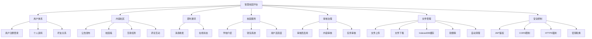

# Smart Campus Service Platform

智慧校园服务平台 - 面向高校数字化场景的全栈应用

## 项目概述

Smart Campus Platform 是一个现代化的智慧校园服务平台，旨在为高校师生提供一站式的数字化校园体验。平台涵盖社交互动、任务协作、信息发布、即时通讯等核心功能，采用前后端分离架构，具备完善的安全控制和审核治理机制。

### 功能架构图



---

## 技术栈

### 前端技术栈

| 技术 | 版本 | 说明 |
|------|------|------|
| Next.js | Latest | React全栈框架，支持SSR/SSG |
| React | Latest | UI组件库 |
| TypeScript | Latest | 类型安全 |
| Tailwind CSS | ^3.4.0 | 原子化CSS框架 |
| lucide-react | Latest | 现代图标库 |
| class-variance-authority | Latest | CSS类变体工具 |
| clsx | Latest | 条件类名工具 |
| tailwind-merge | Latest | Tailwind类合并 |
| tailwindcss-animate | Latest | Tailwind动画扩展 |

### 后端技术栈

| 技术 | 版本 | 说明 |
|------|------|------|
| FastAPI | 0.109.0 | 高性能Python Web框架 |
| Uvicorn | 0.27.0 | ASGI服务器 |
| SQLAlchemy | 2.0.25 | ORM框架 |
| PyMySQL | 1.1.0 | MySQL驱动 |
| python-jose | 3.3.0 | JWT实现 |
| passlib[bcrypt] | 1.7.4 | 密码加密 |
| Pydantic | 2.5.3 | 数据验证 |
| pydantic-settings | 2.1.0 | 配置管理 |
| Redis | 5.0.1 | 缓存支持 |
| APScheduler | 3.10.4 | 定时任务调度 |

### 数据库支持

- **SQLite**: 开发环境默认数据库
- **PostgreSQL**: 生产环境推荐
- **MySQL**: 生产环境支持

---

## 项目结构

```
SmartCampusServicePlatform/
├── app/                        # Next.js 前端应用
│   ├── globals.css            # 全局样式
│   ├── layout.tsx             # 根布局
│   └── page.tsx               # 主页面
├── backend/                    # FastAPI 后端服务
│   ├── app/
│   │   ├── api/               # API路由模块
│   │   │   ├── auth.py        # 认证接口
│   │   │   ├── users.py       # 用户管理
│   │   │   ├── posts.py       # 校园墙
│   │   │   ├── tasks.py       # 互帮互助
│   │   │   ├── wallet.py      # 钱包系统
│   │   │   ├── friends.py     # 好友系统
│   │   │   ├── messages.py    # 消息通知
│   │   │   ├── announcements.py # 公告系统
│   │   │   ├── school.py      # 学校信息
│   │   │   ├── files.py       # 文件管理
│   │   │   ├── activity.py    # 活跃度
│   │   │   └── admin.py       # 管理后台
│   │   ├── core/              # 核心功能
│   │   │   ├── security.py    # 安全工具
│   │   │   └── deps.py        # 依赖注入
│   │   ├── models/            # 数据模型
│   │   │   ├── models.py      # SQLAlchemy模型
│   │   │   └── file_storage.py # 文件存储模型
│   │   ├── schemas/           # Pydantic模式
│   │   ├── tasks/             # 定时任务
│   │   │   ├── file_cleanup.py # 文件清理
│   │   │   └── user_activity_checker.py # 活跃度检查
│   │   ├── websocket/         # WebSocket处理
│   │   │   ├── connection_manager.py # 连接管理
│   │   │   └── routes.py      # WS路由
│   │   ├── utils/             # 工具函数
│   │   ├── config.py          # 配置管理
│   │   ├── database.py        # 数据库连接
│   │   └── main.py            # 应用入口
│   ├── storage/               # 文件存储目录
│   └── requirements.txt       # Python依赖
├── components/                 # React组件
│   ├── ui/                    # 基础UI组件
│   ├── LoginPage.tsx          # 登录页
│   ├── CampusWall.tsx         # 校园墙
│   ├── MutualHelp.tsx         # 互助任务
│   ├── Friends.tsx            # 好友模块
│   ├── Messages.tsx           # 消息中心
│   ├── ChatWindow.tsx         # 聊天窗口
│   ├── Profile.tsx            # 个人中心
│   ├── WalletPage.tsx         # 钱包页面
│   └── ...                    # 其他组件
├── lib/                        # 工具库
│   └── api.ts                 # API服务层
├── config.ts                   # 前端统一配置
├── start.sh                   # 启动脚本
├── stop.sh                    # 停止脚本
└── .env.example               # 环境变量示例
```

---

## 核心功能详解

### 1. 用户认证系统

#### 1.1 用户注册与登录

支持邮箱注册，密码使用bcrypt加密存储，JWT令牌认证。

**后端实现 - 用户注册** (`backend/app/api/auth.py`):

```python
@router.post("/register", response_model=UserResponse, summary="用户注册")
async def register(
    user_data: RegisterRequest,
    db: Session = Depends(get_db)
):
    """用户注册"""
    # Check if email exists
    existing_user = db.query(User).filter(User.email == user_data.email).first()
    if existing_user:
        raise HTTPException(
            status_code=status.HTTP_400_BAD_REQUEST,
            detail="该邮箱已被注册"
        )
    
    # Create new user
    hashed_password = get_password_hash(user_data.password)
    new_user = User(
        email=user_data.email,
        password_hash=hashed_password,
        name=user_data.name,
        phone=user_data.phone,
        role="student",
        status="active"
    )
    
    db.add(new_user)
    db.commit()
    db.refresh(new_user)
    
    # Create wallet for new user
    wallet = Wallet(user_id=new_user.id, balance=0.0, frozen_amount=0.0)
    db.add(wallet)
    db.commit()
    
    return new_user
```

**后端实现 - JWT令牌生成** (`backend/app/core/security.py`):

```python
def create_access_token(data: dict, expires_delta: Optional[timedelta] = None) -> str:
    """创建访问令牌"""
    to_encode = data.copy()
    if expires_delta:
        expire = datetime.utcnow() + expires_delta
    else:
        expire = datetime.utcnow() + timedelta(minutes=settings.ACCESS_TOKEN_EXPIRE_MINUTES)
    to_encode.update({"exp": expire})
    encoded_jwt = jwt.encode(to_encode, settings.SECRET_KEY, algorithm=settings.ALGORITHM)
    return encoded_jwt

def verify_password(plain_password: str, hashed_password: str) -> bool:
    """验证密码"""
    return bcrypt.checkpw(plain_password.encode('utf-8'), hashed_password.encode('utf-8'))

def get_password_hash(password: str) -> str:
    """获取密码哈希"""
    return bcrypt.hashpw(password.encode('utf-8'), bcrypt.gensalt()).decode('utf-8')
```

**前端实现 - 登录页面** (`components/LoginPage.tsx`):

```tsx
const handleSubmit = async (e: React.FormEvent) => {
  e.preventDefault()
  setLoading(true)
  setError('')
  
  try {
    if (isLogin) {
      // 登录
      const tokenResponse = await authApi.login({
        username: formData.email,
        password: formData.password
      })
      
      // 保存token
      setToken(tokenResponse.access_token)
      
      // 获取用户信息
      const user = await authApi.getCurrentUser()
      
      onLogin({
        name: user.name,
        role: user.role,
        avatar: user.avatar
      })
    } else {
      // 注册逻辑...
    }
  } catch (err: any) {
    setError(err.message || '操作失败，请重试')
  } finally {
    setLoading(false)
  }
}
```

#### 1.2 用户角色与权限

系统支持四种用户角色：

| 角色 | 枚举值 | 说明 | 权限 |
|------|--------|------|------|
| 学生 | `student` | 默认角色 | 基础功能 |
| 教师 | `teacher` | 教职工 | 扩展功能 |
| 审核员 | `reviewer` | 内容审核 | 审核权限（信誉分>98自动获得） |
| 管理员 | `admin` | 系统管理 | 全部权限 |

**数据模型定义** (`backend/app/models/models.py`):

```python
class UserRole(str, enum.Enum):
    student = "student"
    teacher = "teacher"
    admin = "admin"

class UserStatus(str, enum.Enum):
    active = "active"
    inactive = "inactive"
    banned = "banned"

class User(Base):
    __tablename__ = "users"
    
    id = Column(Integer, primary_key=True, index=True, comment="用户ID")
    email = Column(String(255), unique=True, index=True, nullable=False, comment="邮箱")
    password_hash = Column(String(255), nullable=False, comment="密码哈希值")
    name = Column(String(100), nullable=False, comment="用户姓名")
    phone = Column(String(20), comment="手机号码")
    avatar = Column(String(500), comment="头像URL")
    role = Column(Enum(UserRole), default=UserRole.student, comment="用户角色")
    status = Column(Enum(UserStatus), default=UserStatus.active, comment="账户状态")
    online_status = Column(String(20), default='offline', comment="在线状态")
    last_active = Column(DateTime, comment="最后活跃时间")
    created_at = Column(DateTime, server_default=func.now(), comment="创建时间")
    
    # 关系
    profile = relationship("UserProfile", back_populates="user", uselist=False)
    posts = relationship("Post", back_populates="author")
    wallet = relationship("Wallet", back_populates="user", uselist=False)
```

---

### 2. 信誉系统

#### 2.1 信誉分机制

每个用户有一个信誉分（初始60分），通过以下方式变化：

- **增加信誉**: 完成任务、获得好评
- **减少信誉**: 违规被删除评论（-2~-10分）、被举报处理

**用户档案模型** (`backend/app/models/models.py`):

```python
class UserProfile(Base):
    __tablename__ = "user_profiles"
    
    id = Column(Integer, primary_key=True, index=True)
    user_id = Column(Integer, ForeignKey("users.id", ondelete="CASCADE"), unique=True)
    student_id = Column(String(50), comment="学号")
    department = Column(String(100), comment="院系")
    major = Column(String(100), comment="专业")
    
    # 信誉系统字段
    credit_score = Column(Integer, default=60, comment="信誉分，初始60分（及格）")
    like_count = Column(Integer, default=0, comment="获赞数")
    total_reviews = Column(Integer, default=0, comment="被评价总数")
    positive_reviews = Column(Integer, default=0, comment="好评数")
    
    @property
    def approval_rate(self):
        """好评率"""
        if self.total_reviews == 0:
            return 1.0  # 无评价时默认100%好评率
        return self.positive_reviews / self.total_reviews
    
    @property
    def priority_score(self):
        """优先分 = (信誉分 + 好评率 * 100) // 2"""
        return (self.credit_score + int(self.approval_rate * 100)) // 2
```

#### 2.2 审核员权限自动获取

信誉分超过98分的用户自动获得审核员权限：

```python
# 审核员所需的最低信誉分
REVIEWER_MIN_CREDIT_SCORE = 98

def is_user_reviewer(user: User, db: Session) -> bool:
    """检查用户是否有审核员权限（信誉分>98或管理员）"""
    if user.role == "admin":
        return True
    profile = db.query(UserProfile).filter(UserProfile.user_id == user.id).first()
    if profile and profile.credit_score > REVIEWER_MIN_CREDIT_SCORE:
        return True
    return False
```

---

### 3. 校园墙（帖子系统）

#### 3.1 帖子发布与审核

帖子发布后需要审核通过才能公开显示：

**帖子模型**:

```python
class PostStatus(str, enum.Enum):
    pending = "pending"     # 待审核
    approved = "approved"   # 已通过
    rejected = "rejected"   # 已拒绝
    deleted = "deleted"     # 已删除

class Post(Base):
    __tablename__ = "posts"
    
    id = Column(Integer, primary_key=True, index=True)
    user_id = Column(Integer, ForeignKey("users.id", ondelete="CASCADE"))
    content = Column(Text, nullable=False, comment="帖子内容")
    images = Column(JSON, comment="图片列表JSON")
    likes_count = Column(Integer, default=0, comment="点赞数")
    comments_count = Column(Integer, default=0, comment="评论数")
    status = Column(Enum(PostStatus), default=PostStatus.approved, comment="审核状态")
    is_anonymous = Column(Boolean, default=False, comment="是否匿名发布")
    created_at = Column(DateTime, server_default=func.now())
    
    author = relationship("User", back_populates="posts")
    tags = relationship("PostTag", back_populates="post")
    comments = relationship("PostComment", back_populates="post")
```

**帖子发布接口**:

```python
@router.post("", response_model=PostResponse, summary="发布帖子")
async def create_post(
    post_data: PostCreate,
    current_user: User = Depends(get_current_user),
    db: Session = Depends(get_db)
):
    """发布新帖子（需要审核后才能显示）"""
    new_post = Post(
        content=post_data.content,
        images=post_data.images,
        is_anonymous=post_data.is_anonymous,
        user_id=current_user.id,
        status="pending"  # 新帖子默认待审核状态
    )
    
    db.add(new_post)
    db.flush()
    
    # Add tags
    if post_data.tag_ids:
        for tag_id in post_data.tag_ids:
            tag = PostTag(post_id=new_post.id, tag_name=f"tag_{tag_id}")
            db.add(tag)
    
    db.commit()
    db.refresh(new_post)
    
    return new_post
```

#### 3.2 评论系统（点赞/拉踩机制）

评论支持点赞和拉踩功能，拉踩数达到阈值自动删除：

**删除条件**: `拉踩数 > 点赞数 * 2 + 5`

```python
# 评论删除条件：拉踩数 > 点赞数 * 2 + 5
DISLIKE_DELETE_THRESHOLD_MULTIPLIER = 2
DISLIKE_DELETE_THRESHOLD_BASE = 5

def check_and_delete_comment_by_dislikes(comment: PostComment, db: Session):
    """检查是否满足拉踩删除条件"""
    threshold = comment.likes_count * DISLIKE_DELETE_THRESHOLD_MULTIPLIER + DISLIKE_DELETE_THRESHOLD_BASE
    if comment.dislikes_count > threshold:
        comment.status = "deleted"
        comment.delete_reason = f"社区投票删除（拉踩数{comment.dislikes_count}超过阈值{threshold}）"
        
        # 创建通知
        notification = Notification(
            user_id=comment.user_id,
            type="comment_deleted",
            title="您的评论已被删除",
            content=f"您的评论因社区投票被删除。惩罚：信誉分-2。"
        )
        db.add(notification)
        
        # 扣除信誉分
        profile = db.query(UserProfile).filter(UserProfile.user_id == comment.user_id).first()
        if profile:
            profile.credit_score = max(0, profile.credit_score - 2)
        
        db.commit()
        return True
    return False
```

#### 3.3 审核员投票删除

3个审核员投票可删除违规评论：

```python
REVIEWER_DELETE_VOTES_REQUIRED = 3

@router.post("/{post_id}/comments/{comment_id}/reviewer-delete", summary="审核员投票删除评论")
async def reviewer_delete_comment(
    post_id: int,
    comment_id: int,
    reason: str = Query(..., description="删除原因"),
    current_user: User = Depends(get_current_user),
    db: Session = Depends(get_db)
):
    """审核员投票删除评论（3票删除）"""
    if not is_user_reviewer(current_user, db):
        raise HTTPException(status_code=403, detail="需要审核员权限（信誉分>98）")
    
    comment = db.query(PostComment).filter(
        PostComment.id == comment_id,
        PostComment.status == "active"
    ).first()
    
    # 添加投票
    vote = CommentReviewerDelete(
        comment_id=comment_id,
        reviewer_id=current_user.id,
        reason=reason
    )
    db.add(vote)
    comment.reviewer_delete_count += 1
    db.commit()
    
    # 检查是否满足删除条件
    if comment.reviewer_delete_count >= REVIEWER_DELETE_VOTES_REQUIRED:
        comment.status = "deleted"
        # 扣除信誉分-5
        profile = db.query(UserProfile).filter(UserProfile.user_id == comment.user_id).first()
        if profile:
            profile.credit_score = max(0, profile.credit_score - 5)
        db.commit()
```

---

### 4. 互助任务系统

#### 4.1 任务发布与悬赏

发布任务时自动冻结悬赏金额：

```python
@router.post("", response_model=TaskResponse, summary="发布任务")
async def create_task(
    task_data: TaskCreate,
    current_user: User = Depends(get_current_user),
    db: Session = Depends(get_db)
):
    """发布新任务"""
    # Check wallet balance
    wallet = db.query(Wallet).filter(Wallet.user_id == current_user.id).first()
    reward_amount = Decimal(str(task_data.reward))
    if not wallet or wallet.balance < reward_amount:
        raise HTTPException(status_code=400, detail="余额不足，请先充值")
    
    # Freeze the reward amount
    wallet.balance -= reward_amount
    wallet.frozen_amount += reward_amount
    
    new_task = HelpTask(
        title=task_data.title,
        description=task_data.description,
        category=task_data.category.value,
        reward=task_data.reward,
        location=task_data.location,
        deadline=task_data.deadline,
        publisher_id=current_user.id,
        status="open",
        private_info=task_data.private_info  # 私密信息（快递码等）
    )
    
    db.add(new_task)
    db.commit()
    return new_task
```

#### 4.2 任务申请与优先分排序

申请者按优先分排序，优先分 = (信誉分 + 好评率*100) / 2：

```python
@router.get("/{task_id}/applications", summary="获取申请列表")
async def get_applications(
    task_id: int,
    current_user: User = Depends(get_current_user),
    db: Session = Depends(get_db)
):
    """获取任务申请列表，按优先分排序"""
    applications = db.query(TaskApplication).filter(
        TaskApplication.task_id == task_id
    ).all()
    
    def get_priority_score(application):
        profile = db.query(UserProfile).filter(
            UserProfile.user_id == application.applicant_id
        ).first()
        
        if not profile:
            return 80  # 默认值
        
        credit_score = profile.credit_score or 60
        approval_rate = 1.0
        if profile.total_reviews and profile.total_reviews > 0:
            approval_rate = (profile.positive_reviews or 0) / profile.total_reviews
        
        # 优先分 = (信誉分 + 好评率 * 100) // 2
        return (credit_score + int(approval_rate * 100)) // 2
    
    # 按优先分降序排序
    applications_sorted = sorted(applications, key=get_priority_score, reverse=True)
    
    return applications_sorted
```

#### 4.3 任务完成与奖励发放

```python
@router.post("/{task_id}/complete", summary="完成任务")
async def complete_task(
    task_id: int,
    current_user: User = Depends(get_current_user),
    db: Session = Depends(get_db)
):
    """确认任务完成（发布者操作）"""
    task = db.query(HelpTask).filter(HelpTask.id == task_id).first()
    
    if task.publisher_id != current_user.id:
        raise HTTPException(status_code=403, detail="只有任务发布者可以确认完成")
    
    # Transfer reward
    publisher_wallet = db.query(Wallet).filter(Wallet.user_id == current_user.id).first()
    assignee_wallet = db.query(Wallet).filter(Wallet.user_id == task.assignee_id).first()
    reward_amount = Decimal(str(task.reward))
    
    # 从冻结金额扣除
    publisher_wallet.frozen_amount -= reward_amount
    
    # 发放给接单者
    assignee_wallet.balance += reward_amount
    assignee_wallet.total_income = (assignee_wallet.total_income or Decimal('0')) + reward_amount
    
    # Create transaction record
    transaction = Transaction(
        wallet_id=assignee_wallet.id,
        user_id=task.assignee_id,
        type=TransactionType.task_reward,
        amount=task.reward,
        balance_after=assignee_wallet.balance,
        description=f"任务奖励：{task.title}",
        status="completed"
    )
    db.add(transaction)
    
    task.status = "completed"
    task.completed_at = datetime.utcnow()
    
    db.commit()
    return SuccessResponse(message="任务完成，奖励已发放")
```

---

### 5. 即时通讯系统

#### 5.1 WebSocket连接管理

```python
class ConnectionManager:
    def __init__(self):
        # 存储每个用户的WebSocket连接：{user_id: {websocket1, websocket2, ...}}
        self.active_connections: Dict[int, Set[WebSocket]] = {}
    
    async def connect(self, websocket: WebSocket, user_id: int):
        """接受WebSocket连接"""
        await websocket.accept()
        
        if user_id not in self.active_connections:
            self.active_connections[user_id] = set()
        
        self.active_connections[user_id].add(websocket)
    
    async def send_personal_message(self, message: dict, user_id: int):
        """发送消息给指定用户的所有连接"""
        if user_id not in self.active_connections:
            return
        
        for websocket in self.active_connections[user_id]:
            try:
                await websocket.send_json(message)
            except Exception as e:
                # Handle disconnected connections
                pass
    
    def is_user_online(self, user_id: int) -> bool:
        """检查用户是否在线"""
        return user_id in self.active_connections and len(self.active_connections[user_id]) > 0

# 全局连接管理器实例
manager = ConnectionManager()
```

#### 5.2 消息发送与推送

```python
@router.post("", response_model=MessageResponse, summary="发送消息")
async def send_message(
    message_data: MessageCreate,
    current_user: User = Depends(get_current_user),
    db: Session = Depends(get_db)
):
    """发送消息"""
    # Check if blocked
    blocked = db.query(Blacklist).filter(
        Blacklist.user_id == message_data.receiver_id,
        Blacklist.blocked_user_id == current_user.id
    ).first()
    
    if blocked:
        raise HTTPException(status_code=403, detail="对方已将你拉黑，无法发送消息")
    
    message = Message(
        sender_id=current_user.id,
        receiver_id=message_data.receiver_id,
        content=message_data.content,
        message_type=message_data.type,
        is_read=False
    )
    
    db.add(message)
    db.commit()
    db.refresh(message)
    
    # 通过WebSocket推送消息给接收者
    ws_message = {
        "type": "new_message",
        "data": {
            "id": message.id,
            "sender_id": message.sender_id,
            "receiver_id": message.receiver_id,
            "content": message.content,
            "created_at": message.created_at.isoformat(),
            "sender": {
                "id": current_user.id,
                "name": current_user.name,
                "avatar": current_user.avatar
            }
        }
    }
    
    await manager.send_personal_message(ws_message, message_data.receiver_id)
    
    return message
```

#### 5.3 在线状态检测

```python
@router.get("/online", summary="获取在线好友ID列表")
async def get_online_friends(
    current_user: User = Depends(get_current_user),
    db: Session = Depends(get_db)
) -> List[int]:
    """获取当前用户的好友中哪些在线"""
    friendships = db.query(Friendship).filter(Friendship.user_id == current_user.id).all()
    friend_ids = [f.friend_id for f in friendships]
    
    if not friend_ids:
        return []
    
    # 在线判断：WebSocket连接 或 (数据库状态为online 且 最后活跃时间在5分钟内)
    online_threshold = datetime.utcnow() - timedelta(minutes=5)
    
    # 从数据库查询活跃用户
    db_online_users = db.query(User.id).filter(
        User.id.in_(friend_ids),
        User.online_status == 'online',
        User.last_active >= online_threshold
    ).all()
    db_online_ids = {u.id for u in db_online_users}
    
    # 结合WebSocket状态
    ws_online_ids = {fid for fid in friend_ids if manager.is_user_online(fid)}
    
    # 合并两种在线状态
    return list(db_online_ids | ws_online_ids)
```

---

### 6. 钱包系统

#### 6.1 钱包模型

```python
class Wallet(Base):
    __tablename__ = "wallets"
    
    id = Column(Integer, primary_key=True, index=True)
    user_id = Column(Integer, ForeignKey("users.id", ondelete="CASCADE"), unique=True)
    balance = Column(DECIMAL(12, 2), default=0, comment="可用余额")
    frozen_amount = Column(DECIMAL(12, 2), default=0, comment="冻结金额")
    total_income = Column(DECIMAL(12, 2), default=0, comment="总收入")
    total_expense = Column(DECIMAL(12, 2), default=0, comment="总支出")

class TransactionType(str, enum.Enum):
    recharge = "recharge"           # 充值
    withdraw = "withdraw"           # 提现
    transfer_in = "transfer_in"     # 转入
    transfer_out = "transfer_out"   # 转出
    task_reward = "task_reward"     # 任务奖励
    task_payment = "task_payment"   # 任务支付
    refund = "refund"               # 退款
```

#### 6.2 转账功能

```python
@router.post("/transfer", summary="转账")
async def transfer(
    transfer_data: TransferCreate,
    current_user: User = Depends(get_current_user),
    db: Session = Depends(get_db)
):
    """向其他用户转账"""
    if transfer_data.to_user_id == current_user.id:
        raise HTTPException(status_code=400, detail="不能给自己转账")
    
    # Check sender balance
    sender_wallet = db.query(Wallet).filter(Wallet.user_id == current_user.id).first()
    if not sender_wallet or sender_wallet.balance < transfer_data.amount:
        raise HTTPException(status_code=400, detail="余额不足")
    
    # Get or create recipient wallet
    recipient_wallet = db.query(Wallet).filter(Wallet.user_id == transfer_data.to_user_id).first()
    if not recipient_wallet:
        recipient_wallet = Wallet(user_id=transfer_data.to_user_id, balance=0.0)
        db.add(recipient_wallet)
    
    # Transfer
    sender_wallet.balance -= transfer_data.amount
    recipient_wallet.balance += transfer_data.amount
    
    # Create transaction records
    sender_transaction = Transaction(
        wallet_id=sender_wallet.id,
        amount=transfer_data.amount,
        type="transfer_out",
        status="completed",
        description=f"转账给{recipient.name}"
    )
    
    recipient_transaction = Transaction(
        wallet_id=recipient_wallet.id,
        amount=transfer_data.amount,
        type="transfer_in",
        status="completed",
        description=f"来自{current_user.name}的转账"
    )
    
    db.add_all([sender_transaction, recipient_transaction])
    db.commit()
    
    return SuccessResponse(message="转账成功")
```

---

### 7. 好友系统

#### 7.1 好友请求与自动互加

```python
@router.post("/requests", summary="发送好友请求")
async def send_friend_request(
    request_data: FriendRequestCreate,
    current_user: User = Depends(get_current_user),
    db: Session = Depends(get_db)
):
    """发送好友请求"""
    # Check if in blacklist
    in_blacklist = db.query(Blacklist).filter(
        Blacklist.user_id == request_data.to_user_id,
        Blacklist.blocked_user_id == current_user.id
    ).first()
    
    if in_blacklist:
        raise HTTPException(status_code=400, detail="对方已将你拉黑")
    
    # Check if target user sent request to us (自动互加)
    reverse_request = db.query(FriendRequest).filter(
        FriendRequest.from_user_id == request_data.to_user_id,
        FriendRequest.to_user_id == current_user.id,
        FriendRequest.status == "pending"
    ).first()
    
    if reverse_request:
        # Auto accept - 双向添加好友
        reverse_request.status = "accepted"
        db.add(Friendship(user_id=current_user.id, friend_id=request_data.to_user_id))
        db.add(Friendship(user_id=request_data.to_user_id, friend_id=current_user.id))
        db.commit()
        return reverse_request
    
    # Create new request
    friend_request = FriendRequest(
        from_user_id=current_user.id,
        to_user_id=request_data.to_user_id,
        message=request_data.message,
        status="pending"
    )
    
    db.add(friend_request)
    db.commit()
    return friend_request
```

#### 7.2 黑名单管理

```python
@router.post("/blacklist", summary="添加黑名单")
async def add_to_blacklist(
    blacklist_data: BlacklistCreate,
    current_user: User = Depends(get_current_user),
    db: Session = Depends(get_db)
):
    """将用户加入黑名单"""
    # Remove friendship if exists
    db.query(Friendship).filter(
        or_(
            and_(Friendship.user_id == current_user.id, 
                 Friendship.friend_id == blacklist_data.blocked_user_id),
            and_(Friendship.user_id == blacklist_data.blocked_user_id, 
                 Friendship.friend_id == current_user.id)
        )
    ).delete()
    
    # Add to blacklist
    blacklist = Blacklist(
        user_id=current_user.id,
        blocked_user_id=blacklist_data.blocked_user_id,
        reason=blacklist_data.reason
    )
    
    db.add(blacklist)
    db.commit()
    return blacklist
```

---

### 8. 文件管理系统

#### 8.1 文件上传

```python
@router.post("/upload", summary="上传文件")
async def upload_file(
    file: UploadFile = File(...),
    message_id: int = 0,
    current_user: User = Depends(get_current_user),
    db: Session = Depends(get_db)
):
    """
    上传文件到服务器
    - 自动去重(相同文件只存储一次)
    - 支持硬链接引用计数
    """
    try:
        file_data = await file.read()
        mime_type = file.content_type or "application/octet-stream"
        
        metadata = await file_manager.save_file(
            file_data=file_data,
            message_id=message_id,
            mime_type=mime_type,
            db=db
        )
        
        return {
            "file_id": metadata.id,
            "file_hash": metadata.file_hash,
            "file_size": metadata.file_size,
            "mime_type": metadata.mime_type,
            "reference_count": metadata.reference_count
        }
    
    except Exception as e:
        raise HTTPException(status_code=500, detail=f"文件上传失败: {str(e)}")
```

---

### 9. 前端API服务层

**统一的API请求封装** (`lib/api.ts`):

```typescript
// Token管理
export const getToken = (): string | null => {
  if (typeof window !== 'undefined') {
    return localStorage.getItem('access_token');
  }
  return null;
};

export const setToken = (token: string): void => {
  if (typeof window !== 'undefined') {
    localStorage.setItem('access_token', token);
  }
};

// 通用请求方法
async function request<T>(
  endpoint: string,
  options: RequestInit = {}
): Promise<T> {
  const token = getToken();
  
  const headers: HeadersInit = {
    'Content-Type': 'application/json',
    ...options.headers,
  };
  
  if (token) {
    (headers as Record<string, string>)['Authorization'] = `Bearer ${token}`;
  }
  
  const response = await fetch(`${API_BASE_URL}${endpoint}`, {
    ...options,
    headers,
  });
  
  if (!response.ok) {
    const error = await response.json().catch(() => ({ detail: '请求失败' }));
    throw new Error(error.detail || '请求失败');
  }
  
  return response.json();
}

// ============ API模块示例 ============

export const authApi = {
  login: async (data: LoginRequest): Promise<TokenResponse> => {...},
  register: async (data: RegisterRequest): Promise<User> => {...},
  getCurrentUser: async (): Promise<User> => {...},
  changePassword: async (oldPassword: string, newPassword: string): Promise<void> => {...},
};

export const postsApi = {
  getPosts: async (page, pageSize, keyword): Promise<PostListResponse> => {...},
  createPost: async (data: CreatePostRequest): Promise<Post> => {...},
  likePost: async (postId: number): Promise<void> => {...},
  // 审核相关
  checkReviewerStatus: async (): Promise<ReviewerStatus> => {...},
  approvePost: async (postId: number): Promise<void> => {...},
  rejectPost: async (postId: number, reason?: string): Promise<void> => {...},
};

export const tasksApi = {
  getTasks: async (page, pageSize, category?, status?): Promise<TaskListResponse> => {...},
  createTask: async (data: CreateTaskRequest): Promise<Task> => {...},
  applyTask: async (taskId: number, message?: string): Promise<void> => {...},
  completeTask: async (taskId: number): Promise<void> => {...},
};

export const walletApi = {
  getWallet: async (): Promise<Wallet> => {...},
  getTransactions: async (page, pageSize, type?): Promise<TransactionListResponse> => {...},
  recharge: async (amount: number, paymentMethod: string): Promise<{ order_no: string }> => {...},
};

export const friendsApi = {
  getFriends: async (page, pageSize): Promise<FriendListResponse> => {...},
  getOnlineFriends: async (): Promise<number[]> => {...},
  sendFriendRequest: async (toUserId: number, message?: string): Promise<void> => {...},
};

export const messagesApi = {
  getConversations: async (): Promise<{ items: Conversation[]; total: number }> => {...},
  sendMessage: async (receiverId: number, content: string, type): Promise<Message> => {...},
};
```

---

## 快速开始

### 环境要求

- Node.js >= 18.x
- Python >= 3.9
- npm 或 yarn

### 1. 克隆项目

```bash
git clone <repository-url>
cd SmartCampusServicePlatform
```

### 2. 配置环境变量

```bash
cp .env.example .env
# 编辑 .env 文件
```

### 3. 安装依赖

```bash
# 前端
npm install

# 后端
cd backend
python -m venv venv
source venv/bin/activate  # Linux/Mac
pip install -r requirements.txt
```

### 4. 启动服务

```bash
./start.sh
```

或手动启动:

```bash
# 后端
cd backend && source venv/bin/activate
uvicorn app.main:app --reload --host 0.0.0.0 --port 8000

# 前端
npm run dev
```

### 5. 访问应用

- **前端应用**: http://localhost:3000
- **API文档 (Swagger)**: http://localhost:8000/docs
- **API文档 (ReDoc)**: http://localhost:8000/redoc

---

## 配置说明

### 环境变量

| 变量名 | 说明 | 默认值 |
|--------|------|--------|
| `NEXT_PUBLIC_API_BASE_URL` | API基础地址 | http://localhost:8000 |
| `NEXT_PUBLIC_APP_URL` | 前端应用地址 | http://localhost:3000 |
| `DATABASE_URL` | 数据库连接URL | sqlite:///./smart_campus.db |
| `JWT_SECRET_KEY` | JWT密钥 | (需修改) |
| `STORAGE_PATH` | 文件存储路径 | ./storage/files |
| `CORS_ORIGINS` | CORS允许源 | http://localhost:3000 |
| `REDIS_HOST` | Redis主机 | localhost |
| `REDIS_PORT` | Redis端口 | 6379 |

### 功能开关

在 `config.ts` 中可配置以下功能开关:

```typescript
features: {
  enableRegistration: true,        // 是否开放注册
  enableEmailVerification: false,  // 是否需要邮箱验证
  enableFileUpload: true,          // 是否允许文件上传
  enableReviewer: true,            // 是否启用审核员系统
  enableWallet: true,              // 是否启用钱包系统
  enableCache: false,              // 是否启用Redis缓存
  enableRateLimit: true,           // 是否启用接口限流
  enableAuditLog: true             // 是否启用审计日志
}
```

### 业务配置

```typescript
business: {
  user: {
    minPasswordLength: 6,
    maxPasswordLength: 32,
    defaultRole: 'student',
    roles: ['student', 'teacher', 'admin', 'reviewer']
  },
  post: {
    maxContentLength: 5000,
    maxImagesCount: 9,
    reviewThreshold: 3  // 审核员投票阈值
  },
  comment: {
    maxContentLength: 500,
    dislikeThreshold: 5,  // 拉踩自动删除阈值
    dislikeRatio: 2       // 点赞数的2倍
  },
  task: {
    maxReward: 1000,
    minReward: 1,
    categories: ['errand', 'purchase', 'study', 'other']
  },
  wallet: {
    initialBalance: 0,
    minBalance: 0,
    maxBalance: 999999,
    minTransferAmount: 1
  }
}
```

---

## 部署建议

### 生产环境检查清单

- [ ] 修改 `JWT_SECRET_KEY` 为安全的随机字符串
- [ ] 配置生产数据库 (PostgreSQL/MySQL)
- [ ] 启用 HTTPS
- [ ] 配置 CORS 白名单
- [ ] 启用 Redis 缓存
- [ ] 配置文件存储路径
- [ ] 设置合适的日志级别
- [ ] 配置反向代理 (Nginx)

---

## License

MIT License

---

**Smart Campus Service Platform** - Building Digital Campus Together
