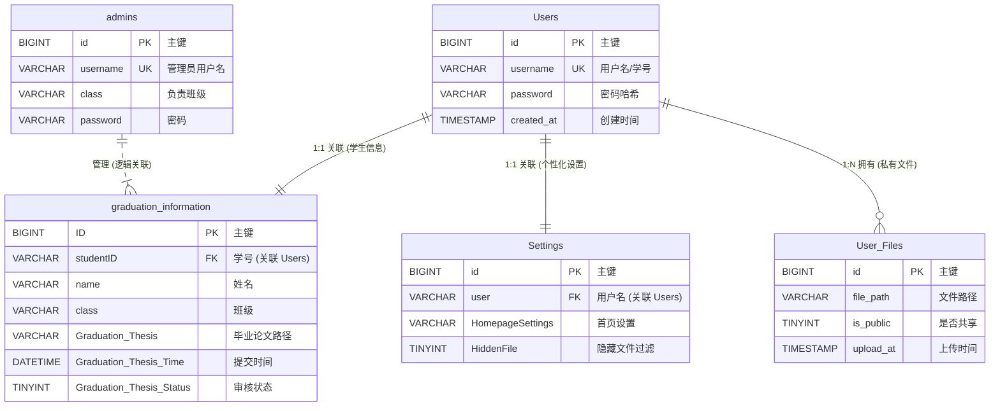

# 第三章 系统总体设计

本章主要介绍系统的技术架构选型、整体结构设计以及数据库模型设计，为后续的功能实现奠定基础。

## 3.1 技术选型与架构

### 3.1.1 技术栈概览

本系统坚持“轻量、高效、原生”的技术选型原则，避免过度依赖庞大的第三方框架，以降低部署难度和系统资源占用。

| 层次 | 技术 | 版本 | 说明 |
|------|------|------|------|
| **前端** | HTML5 / CSS3 | - | 构建语义化页面与响应式布局，采用 Glassmorphism 设计风格 |
| | JavaScript | ES6+ | 原生 JS 实现交互逻辑、分片上传与 API 调用，无 Vue/React 依赖 |
| **后端** | PHP | 8.4+ | 核心业务逻辑处理，利用 PHP 8 新特性提升性能 |
| **数据库** | MySQL | 8.0 | 关系型数据存储，支持 JSON 字段与事务处理 |
| **服务器** | Nginx / Apache | - | Web 服务器，配置伪静态与文件访问权限 |

### 3.1.2 系统架构设计

系统采用经典的 **B/S (Browser/Server)** 三层架构，逻辑清晰，易于维护。

1.  **表现层（Frontend）**：
    *   运行于用户浏览器中。
    *   负责页面的渲染、用户交互事件的捕获。
    *   核心模块包括：文件上传组件（分片处理）、状态展示组件、教师端图表组件。
    *   通过 Fetch API 与后端进行异步数据通信，实现无刷新体验。

2.  **业务逻辑层（Backend API）**：
    *   运行于 PHP 服务器端。
    *   负责接收前端请求，进行身份认证（Session Check）、权限校验。
    *   核心业务逻辑：文件分片合并、数据库 CRUD 操作、毕业提交规范校验、文件流输出。
    *   统一返回 JSON 格式数据（`{ok: true, data: ...}`），实现前后端解耦。

3.  **数据持久层（Data Layer）**：
    *   **MySQL 数据库**：存储用户信息、文件索引、毕业提交状态、审批结果等结构化数据。
    *   **文件系统**：存储实际上传的物理文件。系统采用散列或分类目录存储策略（如 `uploads/2024/class_A/`），避免单目录文件过多。

### 3.1.3 目录结构设计

项目采用了清晰的模块化目录结构，便于功能扩展和代码维护。

```
Project/
├── api/                  # 后端 PHP 接口层
│   ├── ChunkUploader.php # 核心类：分片上传处理器
│   ├── Database.php      # 核心类：数据库连接池
│   ├── login.php         # 认证接口
│   ├── upload.php        # 普通上传接口
│   ├── teacher_stats.php # 教师统计接口
│   └── ...
├── assets/               # 静态资源（图片、图标）
├── config/               # 配置文件（数据库连接配置）
├── css/                  # 样式文件
│   ├── style.css         # 全局样式
│   ├── responsive.css    # 移动端适配样式
│   └── buttons.css       # 按钮组件样式
├── js/                   # 前端逻辑脚本
│   ├── upload.js         # 分片上传核心逻辑
│   ├── files-graduation.js # 毕业提交业务逻辑
│   ├── teacher-core.js   # 教师端核心逻辑
│   └── index.js          # 登录与入口逻辑
├── logs/                 # 系统审计日志
├── template/             # 毕业设计文档模板
├── index.html            # 登录入口页
├── files.html            # 学生文件管理页
└── teacher.html          # 教师管理后台页
```

## 3.2 数据库设计

系统数据库设计遵循第三范式，同时针对特定查询场景（如教师端的批量统计）进行了适度的反范式优化（如宽表设计）。

### 3.2.1 实体关系图 (ER图)



### 3.2.2 核心数据表设计

**1. 用户表 (`Users`)**
存储学生用户的基本认证信息。

| 字段名 | 类型 | 说明 |
| :--- | :--- | :--- |
| `id` | BIGINT | 主键，自增 |
| `username` | VARCHAR(64) | 学号，唯一索引，用于登录 |
| `password` | VARCHAR(255) | 密码哈希值（BCrypt加密） |
| `created_at` | TIMESTAMP | 账号创建时间 |

**2. 毕业生信息与状态表 (`graduation_information`)**
这是系统的核心业务表，采用“宽表”设计，记录了每位学生的毕设提交全貌。

| 字段名 | 类型 | 说明 |
| :--- | :--- | :--- |
| `ID` | BIGINT | 主键 |
| `studentID` | VARCHAR(32) | 学号，外键关联 Users |
| `name` | VARCHAR(64) | 学生姓名 |
| `class` | VARCHAR(64) | 所属班级 |
| `Graduation Thesis` | VARCHAR(255) | 毕业论文-文件路径 |
| `Graduation Thesis Time` | DATETIME | 毕业论文-最后提交时间 |
| `Graduation Thesis Status` | TINYINT | 毕业论文-审核状态 (0:待审 1:通过 2:打回) |
| ... | ... | (包含其他12种文档类型的对应字段) |

**设计亮点**：
采用宽表设计（每种文档类型对应一组字段）而非传统的“用户-文档”一对多关联表，虽然牺牲了一定的扩展性，但在本场景下极大简化了教师端的查询逻辑——教师只需一次 `SELECT` 即可获取全班所有文档的提交矩阵，无需复杂的连表查询，大幅提升了统计页面的加载速度。

**3. 用户私有文件表 (`user_{username}`)**
采用动态分表策略，为每个用户创建一张独立的文件索引表。

| 字段名 | 类型 | 说明 |
| :--- | :--- | :--- |
| `id` | BIGINT | 主键 |
| `file_path` | VARCHAR(1024) | 文件相对路径 |
| `is_public` | TINYINT | 是否共享 |
| `upload_at` | TIMESTAMP | 上传时间 |

**设计亮点**：
动态分表（如 `user_2020001`, `user_2020002`）避免了单张文件表数据量过亿后的性能瓶颈，确保了每个用户在浏览自己网盘时都能获得极快的响应速度。
