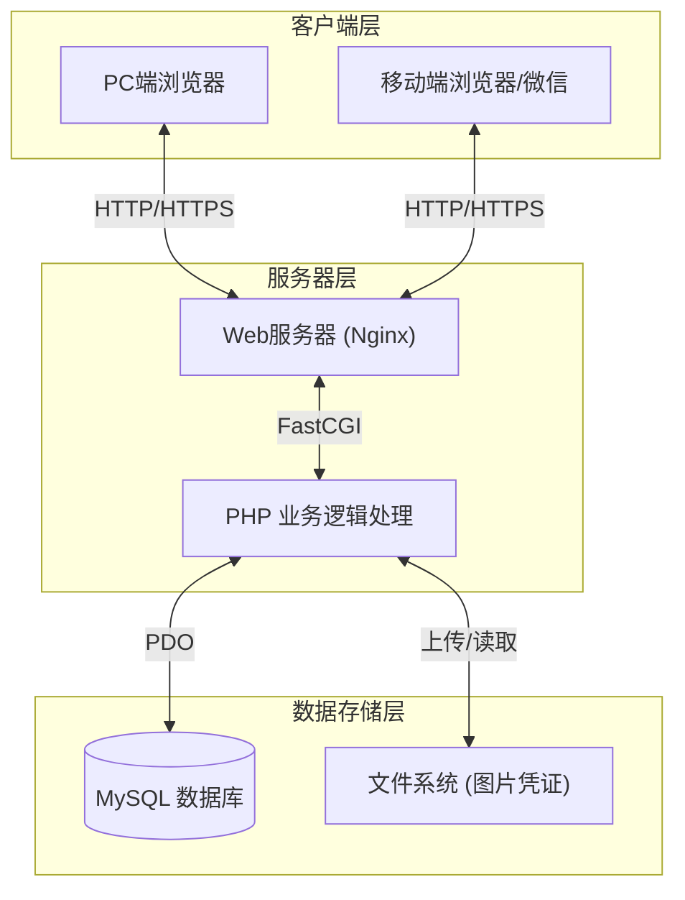
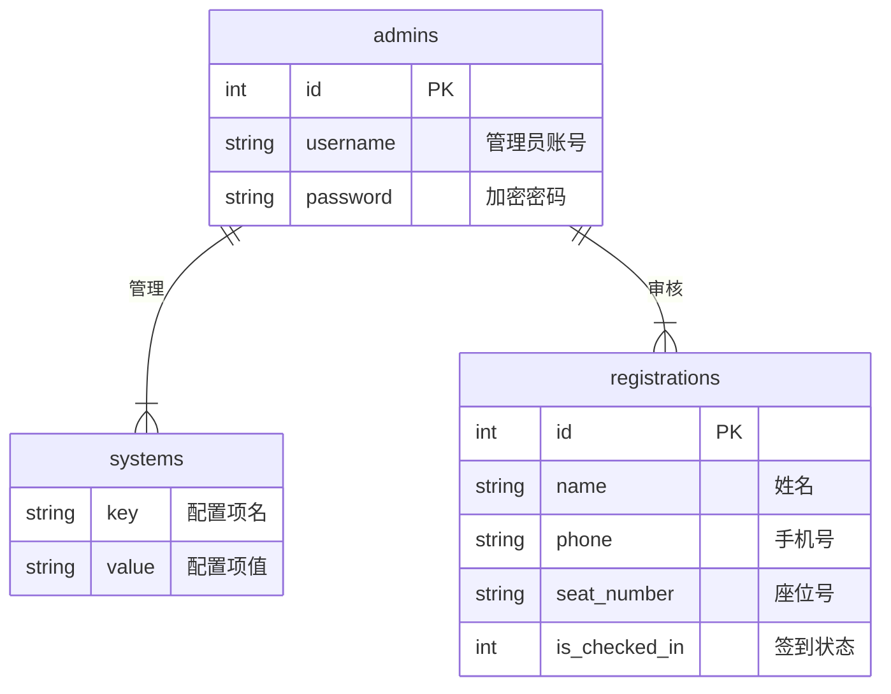

# 第三章 系统分析与设计

## 3.1 可行性分析
### 3.1.1 技术可行性
本系统采用HTML5、CSS3、JavaScript和PHP等成熟的Web开发技术，这些技术在业内应用广泛，学习资源丰富，技术门槛相对较低。同时，MySQL数据库性能稳定，足以支撑校友会活动的规模。因此，从技术层面来看，开发本系统是完全可行的。

### 3.1.2 经济可行性
系统基于开源软件和免费工具开发，无需购买昂贵的商业授权。服务器部署成本低廉，且能够长期使用。相比传统的人工管理方式，本系统能够大幅降低人力成本和沟通成本，具有较高的经济效益。

### 3.1.3 操作可行性
系统界面简洁直观，操作流程符合用户习惯。无论是年轻校友还是年长校友，只需通过手机浏览器即可轻松完成报名和签到。管理员后台功能清晰，无需专业培训即可上手操作。

## 3.2 需求分析
### 3.2.1 功能需求
本系统主要面向三类用户：普通校友、活动管理员和系统管理员。主要功能需求如下：

1.  **用户报名功能**：校友填写个人信息（姓名、届别、联系方式等），选择是否携带家属，提交才艺表演申请，并上传付款凭证。
2.  **信息查询功能**：校友可以查询自己的报名状态、座位号以及活动议程。
3.  **后台管理功能**：管理员可以查看报名列表，审核报名信息，导出数据报表。
4.  **签到功能**：管理员通过扫描校友出示的二维码或输入手机号进行现场签到。
5.  **座位分配功能**：系统支持手动或自动分配座位，并生成座位图。

### 3.2.2 非功能需求
1.  **易用性**：界面友好，操作简单。
2.  **安全性**：保护校友个人隐私，防止数据泄露。
3.  **稳定性**：保证在活动高峰期系统不崩溃。

## 3.3 系统设计
### 3.3.1 系统架构设计
本系统采用B/S（浏览器/服务器）架构，分为客户端层、服务器层和数据存储层。


*图3-1 系统架构图*

### 3.3.2 数据库设计
根据实际业务需求，本系统设计了以下核心数据表：

1.  **报名信息表 (registrations)**：系统的核心表，存储校友的个人信息（姓名、电话、届别）、报名详情（家属人数、捐款、才艺）、支付凭证以及签到状态。
2.  **导入信息表 (import_info)**：用于存储历史校友数据或批量导入的校友名单，包含基础信息及分配的座位号。
3.  **系统配置表 (systems)**：存储系统的全局配置项，如报名起止时间、各功能页面的开放状态等。
4.  **管理员表 (admins)**：存储后台管理员的账号信息。
5.  **管理员日志表 (admins_logs)**：记录管理员的登录行为，用于安全审计。


*图3-2 数据库ER图*

### 3.3.3 关键技术与功能实现
系统在开发过程中采用了一些关键技术手段来解决实际业务问题，以下分前端和后端两部分选取核心代码进行展示。

#### 3.3.3.1 前端交互实现
前端主要负责用户界面的展示和交互逻辑，采用了原生JavaScript结合ES6新特性，实现了流畅的用户体验。

**1. 图片压缩与预览**
为了节省流量并加快上传速度，系统在前端实现了图片压缩功能。在用户选择图片后，通过Canvas对图片进行压缩处理，再上传至服务器。

```javascript
// 前端图片压缩核心代码
function compressImage(file, quality = 0.7) {
    return new Promise((resolve) => {
        const reader = new FileReader();
        reader.onload = (e) => {
            const img = new Image();
            img.onload = () => {
                const canvas = document.createElement('canvas');
                const ctx = canvas.getContext('2d');
                // 计算压缩后的宽高
                let width = img.width;
                let height = img.height;
                canvas.width = width;
                canvas.height = height;
                
                ctx.drawImage(img, 0, 0, width, height);
                // 输出压缩后的base64
                const dataUrl = canvas.toDataURL('image/jpeg', quality);
                resolve(dataUrl);
            };
            img.src = e.target.result;
        };
        reader.readAsDataURL(file);
    });
}
```

**2. 动态二维码生成**
为了实现现场快速签到，前端引入了 `qrcode.js` 库，根据服务器返回的加密签到码动态生成二维码，无需后端生成图片，减轻了服务器压力。

```javascript
// 生成签到二维码
function generateQRCode(checkinCode) {
    const qrcodeContainer = document.getElementById("qrcode");
    qrcodeContainer.innerHTML = ""; // 清空旧码
    new QRCode(qrcodeContainer, {
        text: checkinCode,
        width: 200,
        height: 200,
        colorDark : "#000000",
        colorLight : "#ffffff",
        correctLevel : QRCode.CorrectLevel.H
    });
}
```

#### 3.3.3.2 后端逻辑实现
后端主要负责业务逻辑处理、数据校验和数据库操作，采用了PHP面向对象编程模式。

**1. 批量座位分配算法**
为了解决手动为大量校友分配座位的繁琐问题，系统实现了批量分配算法。管理员只需指定起始座位号和数量，系统即可自动完成分配。

```php
// 核心逻辑：批量分配座位
function batchAssignSeats() {
    global $pdo;
    $input = json_decode(file_get_contents('php://input'), true);
    $ids = array_map('intval', $input['ids']); // 获取选中的用户ID
    $prefix = trim($input['prefix'] ?? '');
    $startNumber = intval($input['startNumber'] ?? 1);

    $pdo->beginTransaction(); // 开启事务保证数据一致性
    try {
        $currentNumber = $startNumber;
        foreach ($ids as $id) {
            $seatNumber = $prefix . $currentNumber; // 生成座位号 (如: A-1)
            $updateSql = "UPDATE registrations SET seat_number = :seat_number WHERE id = :id";
            $updateStmt = $pdo->prepare($updateSql);
            $updateStmt->execute([':seat_number' => $seatNumber, ':id' => $id]);
            $currentNumber++;
        }
        $pdo->commit();
        echo json_encode(['success' => true, 'message' => "批量分配完成"]);
    } catch (Exception $e) {
        $pdo->rollBack();
        throw $e;
    }
}
```

**2. 付款凭证安全上传**
系统支持用户上传微信或支付宝的付款截图，为防止恶意文件上传，后端进行了严格的类型和大小校验，并重命名文件以避免冲突。

```php
// 核心逻辑：文件验证与保存
private function handleFileUpload($file, $userData) {
    // 验证文件类型 (仅限图片)
    $allowedTypes = ['image/jpeg', 'image/jpg', 'image/png', 'image/gif'];
    if (!in_array($file['type'], $allowedTypes)) throw new Exception('不支持的文件类型');
    
    // 验证大小 (最大 5MB)
    if ($file['size'] > 5 * 1024 * 1024) throw new Exception('文件大小超过限制');

    // 生成文件名：姓名_手机号.扩展名
    $extension = pathinfo($file['name'], PATHINFO_EXTENSION);
    $filename = $userData['name'] . '_' . $userData['phone'] . '.' . $extension;
    
    $uploadDir = __DIR__ . '/../pages/payment-records/';
    // ...保存文件逻辑
}
```

**3. 实时签到状态同步**
签到功能要求高实时性，系统通过更新数据库的时间戳字段来标记签到状态，确保数据准确无误。

```php
// 核心逻辑：签到状态与时间同步
if ($isCheckedIn == 1) {
    // 标记为已签到，记录当前时间
    $sql = "UPDATE registrations SET is_checked_in = 1, checkin_time = CURRENT_TIMESTAMP WHERE id = :id";
} else {
    // 取消签到，清空时间
    $sql = "UPDATE registrations SET is_checked_in = 0, checkin_time = NULL WHERE id = :id";
}
$stmt = $pdo->prepare($sql);
$stmt->execute([':id' => $id]);
```

### 3.3.4 功能模块设计
系统主要划分为以下模块：
1.  **前台模块**：首页、报名页、个人中心、活动详情页。
2.  **后台模块**：仪表盘、用户管理、报名管理、签到管理、系统设置。
