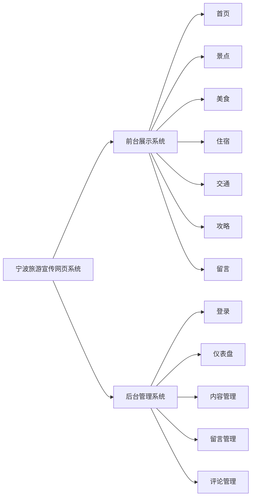
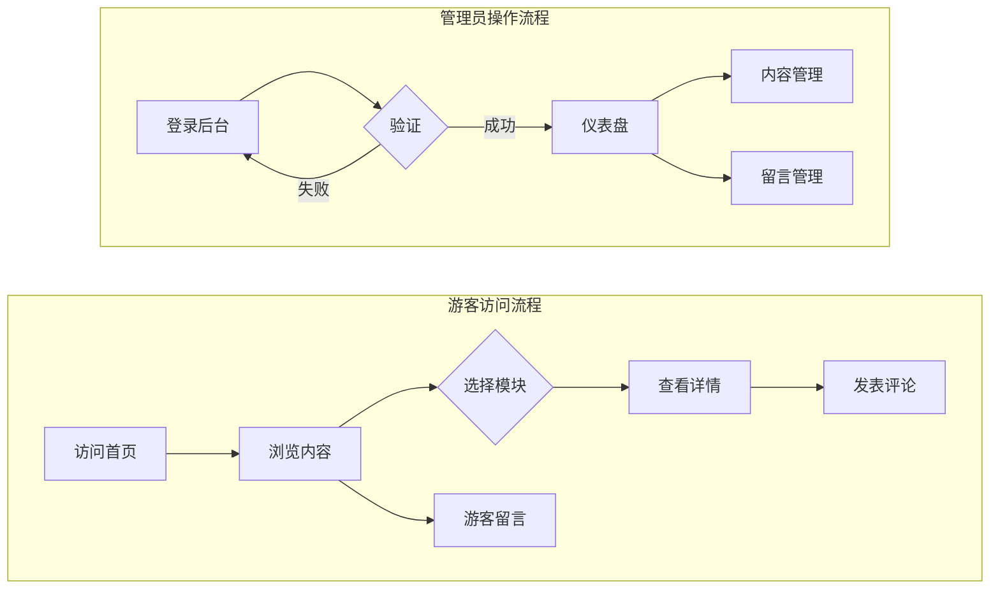
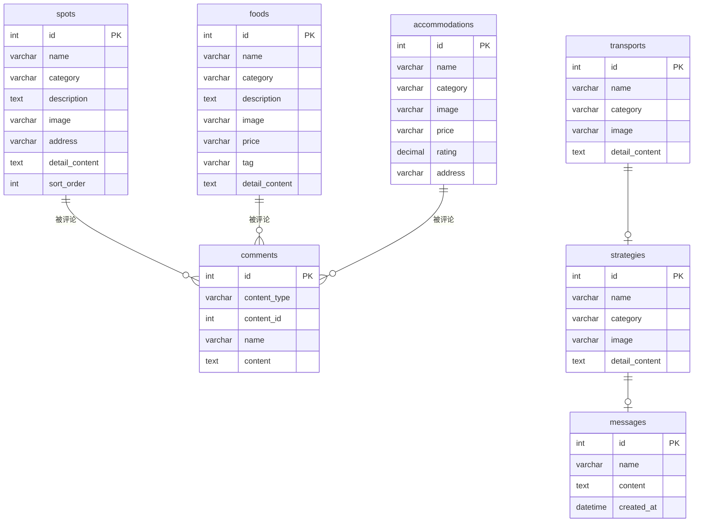
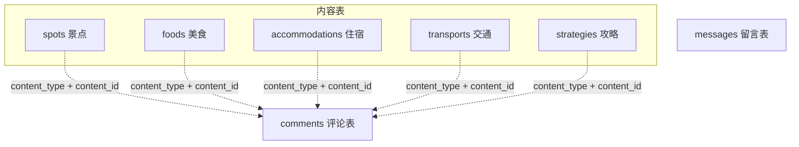
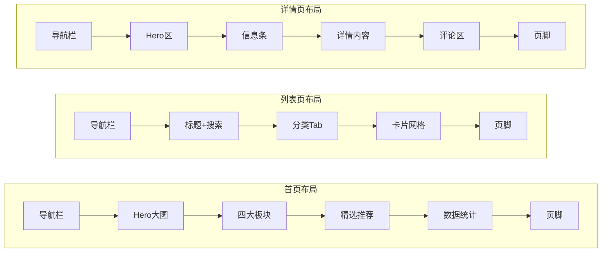

# 第三章 系统设计

## 3.1 系统功能结构

本系统采用前后端分离的B/S架构，分为前台展示和后台管理两部分。

### 3.1.1 系统功能结构图

**图3-1 系统功能结构图**

### 3.1.2 系统业务流程图

**图3-2 系统业务流程图**

## 3.2 数据库设计

数据库是系统的核心，本系统使用MySQL数据库，数据库名为 `ningbo_tourism`，共包含7张数据表。

### 3.2.1 数据库E-R图

**图3-3 数据库E-R图**

### 3.2.2 数据表详细设计

#### （1）景点表（spots）

| 字段名 | 类型 | 说明 |
|-------|------|------|
| id | INT | 主键，自增 |
| name | VARCHAR(100) | 景点名称 |
| category | VARCHAR(50) | 分类：自然风光/人文古迹/红色研学 |
| description | TEXT | 景点简介 |
| image | VARCHAR(255) | 封面图片路径 |
| address | VARCHAR(200) | 地址 |
| ticket | VARCHAR(100) | 门票信息 |
| level | VARCHAR(50) | 景区等级 |
| detail_content | TEXT | 详细介绍 |
| sort_order | INT | 排序序号 |
| created_at | DATETIME | 创建时间 |
| updated_at | DATETIME | 更新时间 |

#### （2）美食表（foods）

| 字段名 | 类型 | 说明 |
|-------|------|------|
| id | INT | 主键，自增 |
| name | VARCHAR(100) | 美食名称 |
| category | VARCHAR(50) | 分类：海鲜/传统小吃/糕点甜品/特色菜肴 |
| description | TEXT | 简介 |
| image | VARCHAR(255) | 图片路径 |
| price | VARCHAR(50) | 参考价格 |
| tag | VARCHAR(100) | 标签 |
| detail_content | TEXT | 详细介绍 |
| sort_order | INT | 排序序号 |

#### （3）住宿表（accommodations）

| 字段名 | 类型 | 说明 |
|-------|------|------|
| id | INT | 主键，自增 |
| name | VARCHAR(100) | 住宿名称 |
| category | VARCHAR(50) | 分类：星级酒店/特色民宿/经济连锁/青年旅舍 |
| description | TEXT | 简介 |
| image | VARCHAR(255) | 图片路径 |
| price | VARCHAR(50) | 参考价格 |
| rating | DECIMAL(2,1) | 评分 |
| address | VARCHAR(255) | 地址 |
| detail_content | TEXT | 详细介绍 |

#### （4）交通表（transports）

| 字段名 | 类型 | 说明 |
|-------|------|------|
| id | INT | 主键，自增 |
| name | VARCHAR(100) | 交通方式名称 |
| category | VARCHAR(50) | 分类：航空/铁路/公路/市内 |
| description | TEXT | 简介 |
| image | VARCHAR(255) | 图片路径 |
| detail_content | TEXT | 详细介绍 |

#### （5）攻略表（strategies）

| 字段名 | 类型 | 说明 |
|-------|------|------|
| id | INT | 主键，自增 |
| name | VARCHAR(100) | 攻略标题 |
| category | VARCHAR(50) | 分类：行程推荐/美食攻略/季节专题 |
| description | TEXT | 简介 |
| image | VARCHAR(255) | 封面图片 |
| detail_content | TEXT | 详细内容 |

#### （6）留言表（messages）

| 字段名 | 类型 | 说明 |
|-------|------|------|
| id | INT | 主键，自增 |
| name | VARCHAR(50) | 用户昵称 |
| content | TEXT | 留言内容 |
| created_at | DATETIME | 创建时间 |

#### （7）评论表（comments）

| 字段名 | 类型 | 说明 |
|-------|------|------|
| id | INT | 主键，自增 |
| content_type | VARCHAR(50) | 关联类型：spot/food等 |
| content_id | INT | 关联内容的ID |
| name | VARCHAR(50) | 用户昵称 |
| content | TEXT | 评论内容 |
| created_at | DATETIME | 创建时间 |

### 3.2.3 表关系说明

**图3-4 数据表关系图**

**关系说明：**
- 评论表通过 `content_type` 和 `content_id` 两个字段关联到对应的内容表
- 留言表独立存储，不与其他表关联

## 3.3 界面设计

### 3.3.1 配色方案

| 颜色 | 色值 | 用途 |
|-----|------|------|
| 青铜金 | #B8763E | 主色调，按钮、标题 |
| 宁波绿 | #3D7A5F | 辅助色，标签 |
| 深棕色 | #2C1810 | 文字颜色 |
| 米白色 | #FFFBF5 | 页面背景 |

### 3.3.2 页面布局结构

**图3-5 页面布局结构图**

### 3.3.3 响应式设计

| 设备 | 屏幕宽度 | 网格列数 | 导航样式 |
|------|---------|---------|---------|
| PC端 | ≥1024px | 3列 | 完整导航 |
| 平板端 | 768-1024px | 2列 | 完整导航 |
| 手机端 | <768px | 单列 | 汉堡菜单 |

## 3.4 本章小结

本章完成了系统的整体设计工作：

1. **功能结构设计**：展示了前台和后台的功能模块划分
2. **数据库设计**：设计了7张核心数据表，使用E-R图展示表结构和关系
3. **界面设计**：确定了配色方案和页面布局结构

这些设计为后续的系统实现提供了清晰的指导。
