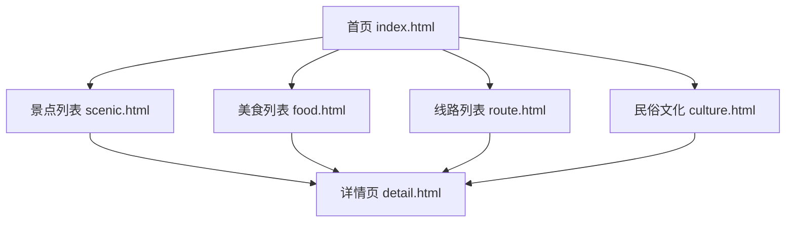

# 第三章：系统设计与技术实现

本章简要介绍平台的技术选型与架构设计，并重点讲解2-3个核心技术实现亮点。

## 3.1 技术栈概览

| 技术 | 用途 | 说明 |
|------|------|------|
| HTML5 | 页面结构 | 语义化标签（header、nav、main、section、footer），有利于SEO和无障碍访问 |
| CSS3 | 样式与动画 | Flex/Grid布局、CSS变量、过渡动画、媒体查询实现响应式 |
| JavaScript (ES6+) | 交互逻辑 | 模块化开发、事件处理、IntersectionObserver懒加载、DOM操作 |
| 响应式设计 | 多端适配 | 移动优先策略，通过媒体查询适配不同屏幕尺寸 |

### 开发工具

| 工具 | 用途 |
|------|------|
| Visual Studio Code | 代码编辑器 |
| Chrome DevTools | 调试与性能分析 |
| Git | 版本控制（可选） |
| Photoshop / Figma | 图片处理与UI设计稿 |

## 3.2 系统架构设计

### 3.2.1 整体架构

本平台采用纯前端静态网站架构，所有数据以JavaScript对象形式集中管理，页面通过DOM操作动态渲染内容。

```
项目目录结构：
├── index.html          # 首页
├── scenic.html         # 景点列表页
├── food.html           # 美食列表页
├── route.html          # 线路列表页
├── culture.html        # 民俗文化页
├── detail.html         # 通用详情页
├── css/
│   ├── style.css       # 全局样式
│   ├── responsive.css  # 响应式样式
│   └── animations.css  # 动画样式
├── js/
│   ├── main.js         # 主逻辑
│   ├── data.js         # 数据管理
│   ├── nav.js          # 导航逻辑
│   └── lazy-load.js    # 懒加载
└── images/
    ├── scenic/         # 景点图片
    ├── food/           # 美食图片
    ├── route/          # 线路图片
    └── culture/        # 民俗图片
```

### 3.2.2 页面关系图



## 3.3 核心实现亮点

### 3.3.1 响应式透明导航栏

**实现思路：**

导航栏使用 `position: fixed` 固定在页面顶部，默认背景色为透明。通过监听页面滚动事件（`scroll`），当滚动距离超过阈值时，动态添加CSS类名来改变导航栏的背景颜色和阴影效果。在移动端，导航菜单折叠为汉堡按钮，通过JavaScript控制菜单的显示与隐藏。

**关键CSS代码：**

```css
/* 导航栏默认透明 */
.header {
    position: fixed;
    top: 0;
    left: 0;
    width: 100%;
    background: transparent;
    transition: background-color 0.3s ease, box-shadow 0.3s ease;
    z-index: 1000;
}

/* 滚动后的状态 */
.header.scrolled {
    background: rgba(0, 0, 0, 0.85);
    box-shadow: 0 2px 10px rgba(0, 0, 0, 0.3);
}
```

**关键JavaScript代码：**

```javascript
// 监听滚动事件，切换导航栏状态
const header = document.querySelector('.header');

window.addEventListener('scroll', () => {
    header.classList.toggle('scrolled', window.scrollY > 10);
});
```

**移动端汉堡菜单核心逻辑：**

```javascript
// 汉堡菜单切换
const menuToggle = document.querySelector('.menu-toggle');
const navMenu = document.querySelector('.nav-menu');

menuToggle.addEventListener('click', () => {
    navMenu.classList.toggle('active');
    menuToggle.classList.toggle('active');
});

// 点击菜单项后自动关闭
navMenu.querySelectorAll('a').forEach(link => {
    link.addEventListener('click', () => {
        navMenu.classList.remove('active');
        menuToggle.classList.remove('active');
    });
});
```

### 3.3.2 图片懒加载

**实现思路：**

使用浏览器原生的 `IntersectionObserver` API 监听图片元素是否进入可视区域。初始时，图片的真实地址存储在 `data-src` 属性中，`src` 属性设置为占位图。当观察器检测到图片即将进入视口时，将 `data-src` 的值赋给 `src`，触发图片加载。

**关键代码：**

```javascript
// 创建 IntersectionObserver 实例
const imageObserver = new IntersectionObserver((entries, observer) => {
    entries.forEach(entry => {
        if (entry.isIntersecting) {
            const img = entry.target;
            // 将 data-src 的值赋给 src，开始加载图片
            img.src = img.dataset.src;
            // 加载完成后添加淡入效果
            img.addEventListener('load', () => {
                img.classList.add('loaded');
            });
            // 停止观察该图片
            observer.unobserve(img);
        }
    });
}, {
    // 提前 200px 开始加载，用户无感知
    rootMargin: '0px 0px 200px 0px'
});

// 对所有需要懒加载的图片进行观察
document.querySelectorAll('img[data-src]').forEach(img => {
    imageObserver.observe(img);
});
```

**配套CSS（淡入效果）：**

```css
img[data-src] {
    opacity: 0;
    transition: opacity 0.5s ease;
}

img.loaded {
    opacity: 1;
}
```

**技术优势：**

- 相比传统的 `scroll` 事件监听方案，`IntersectionObserver` 性能更优，不会阻塞主线程
- `rootMargin` 参数实现了预加载，用户滚动时图片已提前加载完成
- 淡入动画使加载过程更加自然、不突兀

### 3.3.3 分类Tab切换与Hash路由

**实现思路：**

通过监听浏览器的 `hashchange` 事件，检测URL中hash值的变化，并根据hash值更新当前激活的Tab标签和显示对应的内容列表。这种方式实现了无刷新的内容切换，同时支持用户通过URL直接访问某一分类。

**关键代码：**

```javascript
// Tab切换与Hash路由
const tabs = document.querySelectorAll('.tab-item');
const contentPanels = document.querySelectorAll('.content-panel');

// 根据hash值更新UI
function updateTabByHash() {
    const hash = window.location.hash.slice(1) || 'all'; // 默认显示全部

    tabs.forEach(tab => {
        const isActive = tab.dataset.category === hash;
        tab.classList.toggle('active', isActive);
    });

    contentPanels.forEach(panel => {
        if (hash === 'all') {
            panel.style.display = 'block';
        } else {
            panel.style.display = panel.dataset.category === hash ? 'block' : 'none';
        }
    });
}

// 监听hash变化
window.addEventListener('hashchange', updateTabByHash);

// 页面加载时初始化
window.addEventListener('DOMContentLoaded', updateTabByHash);

// Tab点击事件
tabs.forEach(tab => {
    tab.addEventListener('click', () => {
        window.location.hash = tab.dataset.category;
    });
});
```

**技术优势：**

- 页面无需刷新即可切换内容，用户体验流畅
- URL随分类变化，支持浏览器前进/后退操作
- 用户可以直接分享带有分类信息的URL，如 `scenic.html#nature`

### 3.3.4 轮播图实现

**实现思路：**

轮播图采用CSS `transform` 属性实现平滑滑动效果。通过JavaScript定时器控制自动播放，同时提供左右箭头按钮和底部指示点供用户手动切换。

**关键代码：**

```javascript
const slider = document.querySelector('.slider-track');
const slides = document.querySelectorAll('.slide');
let currentIndex = 0;
const totalSlides = slides.length;

// 切换到指定索引的幻灯片
function goToSlide(index) {
    currentIndex = (index + totalSlides) % totalSlides;
    slider.style.transform = `translateX(-${currentIndex * 100}%)`;
    updateDots();
}

// 自动播放（每5秒切换）
let autoPlayTimer = setInterval(() => {
    goToSlide(currentIndex + 1);
}, 5000);

// 鼠标悬停时暂停自动播放
slider.parentElement.addEventListener('mouseenter', () => {
    clearInterval(autoPlayTimer);
});

slider.parentElement.addEventListener('mouseleave', () => {
    autoPlayTimer = setInterval(() => {
        goToSlide(currentIndex + 1);
    }, 5000);
});
```

## 3.4 数据结构设计

平台所有数据以JavaScript对象形式集中管理，便于维护和后续扩展。以下为核心数据结构示例：

```javascript
const SITE_DATA = {
    // 景点数据
    scenic: {
        nature: [
            {
                id: 'scenic_001',
                name: '江郎山',
                category: 'nature',
                image: 'images/scenic/jianglangshan.jpg',
                summary: '世界自然遗产，三爿石鬼斧神工...',
                detail: '江郎山位于浙江省衢州市江山市...',
                address: '浙江省衢州市江山市石门镇',
                ticket: '成人票 100元',
                openTime: '08:00 - 17:00',
                duration: '建议游玩3-4小时'
            },
            // ... 更多景点
        ],
        culture: [
            {
                id: 'scenic_010',
                name: '孔氏南宗家庙',
                category: 'culture',
                image: 'images/scenic/kongmiao.jpg',
                summary: '全国仅有的两座孔氏家庙之一...',
                detail: '孔氏南宗家庙位于衢州市区...',
                address: '浙江省衢州市柯城区新桥街',
                ticket: '免费',
                openTime: '08:30 - 17:00',
                duration: '建议游玩1-2小时'
            },
            // ... 更多人文古迹
        ]
    },

    // 美食数据
    food: {
        snacks: [
            {
                id: 'food_001',
                name: '衢州烤饼',
                category: 'snacks',
                image: 'images/food/kaobing.jpg',
                summary: '衢州传统名小吃，外酥里嫩，葱香四溢...',
                price: '约 3-5元/个',
                recommend: '水亭门老街烤饼摊'
            },
            // ... 更多小吃
        ],
        dishes: [
            {
                id: 'food_010',
                name: '衢州三头一掌',
                category: 'dishes',åå
                image: 'images/food/santou.jpg',
                summary: '兔头、鸭头、鱼头和鸭掌，衢州最具代表性的地方风味...',
                price: '约 60-120元/份',
                recommend: '余记兔头、巷弄鸭头'
            },
            // ... 更多名菜
        ]
    },

    // 线路数据
    route: [
        {
            id: 'route_001',
            name: '衢州古城经典两日游',
            days: 2,
            audience: '家庭出游 / 情侣',
            highlights: ['水亭门历史街区', '孔氏南宗家庙', '烂柯山'],
            schedule: [
                { day: 1, content: '上午游览水亭门历史文化街区，品尝衢州烤饼和小吃...' },
                { day: 2, content: '前往烂柯山景区，感受围棋文化...' }
            ],
            price: '约 500元/人（不含住宿）',
            tips: '建议穿舒适的步行鞋...'
        },
        // ... 更多线路
    ],

    // 民俗数据
    culture: [
        {
            id: 'culture_001',
            name: '南孔祭典',
            category: '传统节日',
            image: 'images/culture/nankong.jpg',
            summary: '衢州孔氏南宗祭祀大典，传承千年的儒学文化仪式...',
            detail: '南孔祭典是衢州孔氏南宗每年举行的祭祀孔子大典...',
            heritage: '浙江省非物质文化遗产'
        },
        {
            id: 'culture_002',
            name: '邵永丰麻饼制作技艺',
            category: '民间技艺',
            image: 'images/culture/mabing.jpg',
            summary: '百年老字号邵永丰的传统麻饼手工制作工艺...',
            detail: '邵永丰麻饼始创于明朝万历年间...',
            heritage: '浙江省非物质文化遗产'
        },
        // ... 更多民俗
    ]
};
```

**数据管理策略：**

- **集中管理**：所有数据存放在 `data.js` 文件中，修改数据无需改动页面结构
- **结构清晰**：按模块和分类组织，层次分明，易于理解和维护
- **扩展方便**：新增景点或美食只需在对应数组中添加对象即可
- **后期升级**：未来可无缝替换为后端API数据源，前端渲染逻辑无需大幅修改
